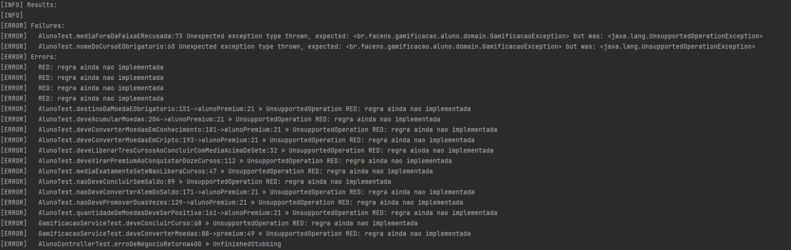
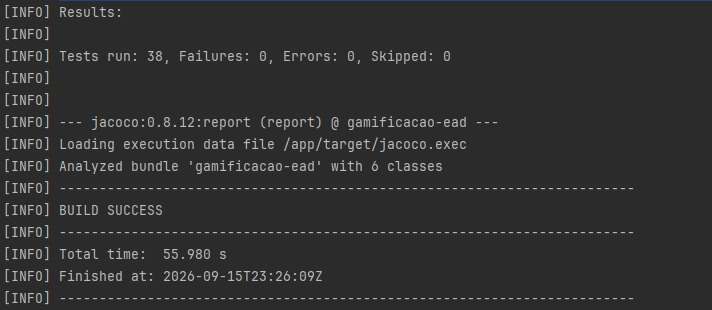
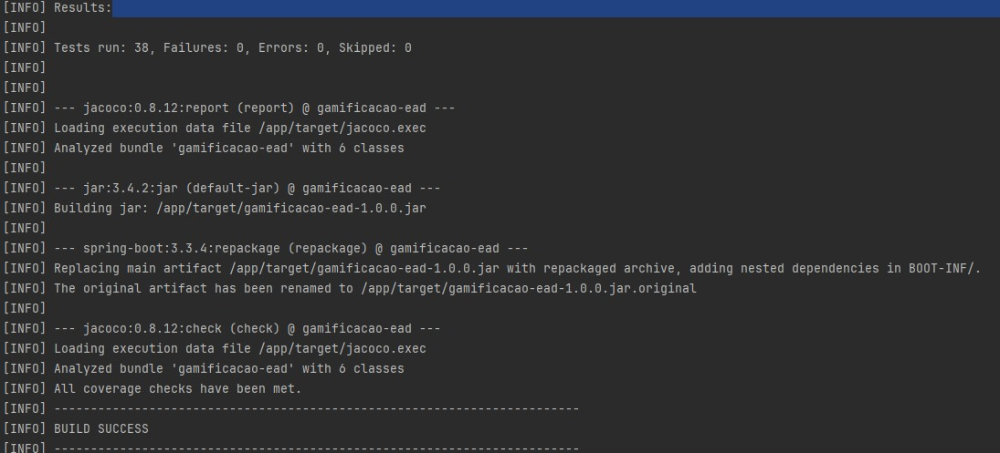
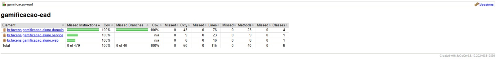

# Evidencias do ATDD

Todos os prints devem ser salvos em `docs/img/` com exatamente estes nomes, para que os
links abaixo funcionem no GitHub.

| # | Evidencia | Arquivo esperado | Como gerar |
|---|---|---|---|
| 1 | TDD - RED | `docs/img/01-red.png` | Ver `docs/TDD-RED.md`. Rodar `mvn test` antes das classes existirem e printar a falha |
| 2 | TDD - GREEN | `docs/img/02-green.png` | `mvn clean test` com BUILD SUCCESS |
| 3 | TDD - BLUE | `docs/img/03-blue.png` | `mvn clean test` de novo, depois das refatoracoes do README |
| 4 | BDD - Cucumber | `docs/img/04-cucumber.png` | Abrir `target/cucumber-report.html`, printar os 5 cenarios verdes |
| 5 | Cobertura Jacoco | `docs/img/05-jacoco.png` | Abrir `target/site/jacoco/index.html`, printar 100% |
| 6 | API no ar | `docs/img/06-api.png` | `mvn spring-boot:run` + as chamadas curl do README |

## 1 - RED

## 2 - GREEN

## 3 - BLUE

## 4 - Cucumber (BDD)

## 5 - Jacoco 100%

## 6 - API

